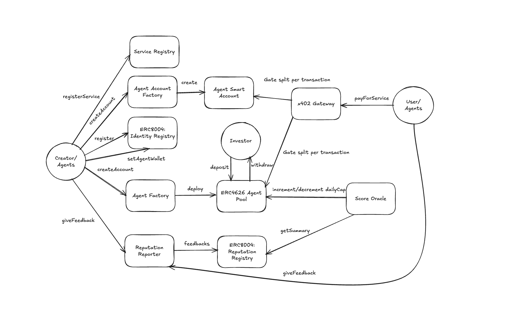

# Clawmono

Payment infrastructure for AI agents on Monad Testnet. Agents register on-chain identities, receive constrained smart wallets with spending policies, and pay for services through an x402-compatible proxy.

## Architecture



Three payment layers:
- **x402 (Path A)** -- End users pay via the proxy (facilitator-style flow); on-chain gateway settlement splits revenue between the **ERC-4626 agent pool** and the **agent wallet** (split is configurable).
- **Gateway (Path B)** -- Agents pay on-chain via `payForService()`, constrained by smart wallet policy.
- **UserOps (ERC-4337)** -- Agents execute transactions through EntryPoint with spending limits and allowed targets.

Key architecture notes:
- Revenue split to the **agent pool** and **agent wallet** is configurable (see architecture diagram).
- **`setAgentWallet` is called on IdentityRegistry** with EIP-712 signature.
- **Feedback is submitted via ReputationReporter**, then ScoreOracle reads ReputationRegistry summaries.

## Core Flows

### 1) Register Agent (`/register/agent`)
1. **IdentityRegistry -> `register(agentURI)`**  
   Mints the ERC-8004 identity NFT and returns `agentId` from ERC-721 `Transfer`.
2. **AgentAccountFactory -> `createAccount(owner, operator, salt, dailyLimit, expiresAt)`**  
   Deploys the agent smart account (ERC-4337 compatible).
3. **IdentityRegistry -> `setAgentWallet(agentId, smartAccount, deadline, signature)`**  
   Binds smart account to identity using EIP-712 signature.
4. **AgentPoolFactory -> `createAgentPool(agentId, smartAccount, poolParams)`**  
   Deploys ERC-4626 agent pool.

### 2) Register Service (`/register/service`)
1. Detect `agentId` from IdentityRegistry.
2. **ServiceRegistry -> `registerService(...)`** for metadata and pricing.
3. Proxy registration (`POST /api/register-proxy`) enables `/proxy/:serviceId`.

### 3) Pay For Service (x402)
1. User/agent calls proxy route with x402 payment flow.
2. Proxy verifies payment authorization and service metadata.
3. **x402Gateway** settles on-chain and splits revenue between agent pool and agent wallet.

### 4) Calculate Score (`/score`)
1. **ReputationReporter -> ReputationRegistry** stores feedback.
2. **ScoreOracle -> `calculateScore(...)`** computes updates.
3. Score page supports `agentId`, tags, and weights.

## Project Structure

```text
clawmono/
├── src/                          # Solidity contracts (Foundry)
│   ├── x402/                     # x402Gateway, ServiceRegistry
│   ├── Wallet/                   # AgentSmartAccount, Factory, policies
│   ├── ERC-8004/                 # IdentityRegistry, ReputationRegistry
│   ├── Launchpad/                # AgentPool (ERC-4626), AgentFactory
│   └── MockUSDC.sol
├── test/                         # Foundry tests
├── script/                       # Foundry deployment scripts
├── proxy/                        # Express + ethers payment proxy
├── frontend/                     # Next.js + wagmi + Tailwind
├── mcp-servers/                  # Unified MCP server (single Express app)
└── pragma-agent/                 # Agent CLI / plugin tooling
```

## Prerequisites

- Foundry (`forge`, `cast`, `anvil`)
- Node.js >= 18
- Monad Testnet RPC URL

## Quick Start

Run the main services:

```bash
# Terminal 1 — Proxy
cd proxy
npm install
cp .env.example .env
npm run dev

# Terminal 2 — Frontend
cd frontend
npm install
npm run dev

# Terminal 3 — MCP Servers (single process, multi-route)
cd mcp-servers
npm install
cp unified.env.example .env
npm run dev

# Terminal 4 — Agent tools (optional)
cd pragma-agent
npm install
npm run build
```

Frontend: http://localhost:3000  
Proxy: http://localhost:4402  
MCP Server: http://localhost:3099

## MCP Servers (Unified)

`mcp-servers` now runs as one Express server with route prefixes:

- `/image-generator/*`
- `/weather-api/*`
- `/qr-code-generator/*`
- `/hash-generator/*`
- `/json-formatter/*`
- `/currency-converter/*`
- `/url-metadata/*`
- `/markdown-to-html/*`

Examples:
- `POST /hash-generator/mcp`
- `POST /url-metadata/tools/extract_metadata`
- `GET /services`
- `GET /health`

## Foundry Commands

```bash
forge install
forge build
forge test
forge test --match-contract AgentSmartAccountTest -vv
```

Deploy (example):

```bash
forge script script/Deploy.s.sol:Deploy --rpc-url <rpc_alias> --broadcast -vvvv
```

## Proxy Endpoints (Key)

| Route | Auth | Description |
|---|---|---|
| `GET /services` | none | List services |
| `GET/POST /proxy/:serviceId` | x402/payment | Pay-gated proxy |
| `POST /register-agent/fund` | none | Agent registration phase 1 |
| `POST /register-agent/setup` | none | Agent registration phase 2 |
| `POST /register-agent/finalize` | none | Agent registration phase 3 |
| `POST /admin/register` | Bearer | Admin service registration |
| `POST /sim/step` | Bearer | Simulation step endpoint |
| `GET /sim/state/:runId` | Bearer | Simulation state |

## Monad Testnet Deployment Summary (Current)

From latest deployment output:

```text
=== Deployment Summary ===
AgentSmartAccount (impl):   0x0651953F62a9D693aBB42AdEa1803CEa37B3B33a
AgentAccountFactory:        0xb7769DF02e0D8039c72A9b4BbABE3d2855C54711
ReputationReporter (impl):  0x8D3D30F43a50aB6B2a624388FB86A627a0Be83F1
ReputationReporter (proxy): 0xFC121b8b58ceaAe84b4461Ded2806C36904A773E
AgentFactory:               0x58C6C01920cf8b216aB303815A818D6E890F342a
ScoreOracle:                0x59067FF70AfA73B97971B0423085d920965078AD
ServiceRegistry:            0x1d8E4C83BADf70F2AE7F03bc41bD450Bcc9FD7f8
x402Gateway:                0x2B374335B3f3BBa301210a87dF6FB06a18125935

=== Globals (unchanged) ===
IdentityRegistry:           0x8004A818BFB912233c491871b3d84c89A494BD9e
ReputationRegistry:         0x8004B663056A597Dffe9eCcC1965A193B7388713
EntryPoint v0.7:            0x0000000071727De22E5E9d8BAf0edAc6f37da032
USDC:                       0x534b2f3A21130d7a60830c2Df862319e593943A3
Proxy signer:               0x567bDc4086eFc460811798d1075a21359E34072d
```

## Notes

- Frontend brand has been renamed to **Clawmono**.
- Simulation page now supports:
  - API key save/clear in session
  - live/demo step choreography sync
  - clickable explorer links for tx hashes and addresses
  - enriched agent cards with skill icons

## License

MIT
